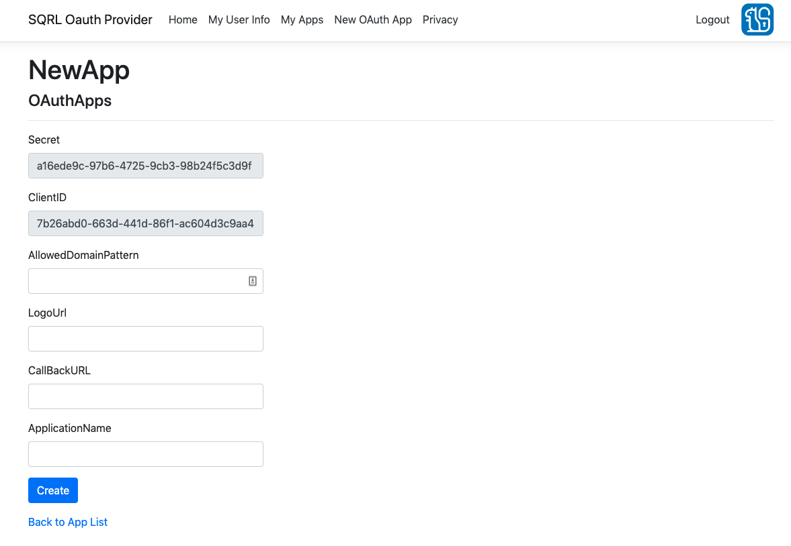
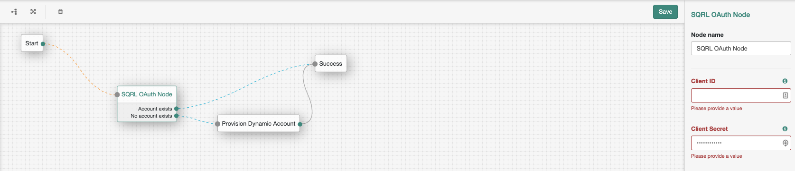

<!--
 * The contents of this file are subject to the terms of the Common Development and
 * Distribution License (the License). You may not use this file except in compliance with the
 * License.
 *
 * You can obtain a copy of the License at legal/CDDLv1.0.txt. See the License for the
 * specific language governing permission and limitations under the License.
 *
 * When distributing Covered Software, include this CDDL Header Notice in each file and include
 * the License file at legal/CDDLv1.0.txt. If applicable, add the following below the CDDL
 * Header, with the fields enclosed by brackets [] replaced by your own identifying
 * information: "Portions copyright [year] [name of copyright owner]".
 *
 * Copyright 2019 ForgeRock AS.
-->
# sqrl-oauth-node

A simple authentication node for ForgeRock's [Identity Platform][forgerock_platform]. This node allows users to authenticate via an external SQRL OAuth2 Provider at https://sqrloauth.com/.

**SQRL Oauth2 Provider**

The OAuth2 Provider is hosted at https://sqrloauth.com/. In order to use this node, the developer must create a new OAuth application with this provider. Users must also register an account with this provider. This will require a SQRL Client - a list of available clients (and more information on SQRL in general) can be found at https://www.grc.com/sqrl/sqrl.htm.

**Usage**

This node should be used in conjunction with the 'Provision Dynamic Account' node so that users authenticating with this provider for the first time have an account created using the first name, surname, full name, and email address properties sent by the provider. A uid will be dynamically generated.

The only configuration an administrator should need to provide on the SQRL OAuth Node is the client ID and client secret, which can be obtained from the provider when an OAuth2 app has been created.

**Build and Installation**

To build, run "mvn clean install" in the directory containing the pom.xml.

Copy the .jar file from the ../target directory into the ../web-container/webapps/openam/WEB-INF/lib directory where AM is deployed. Restart the web container to pick up the new node. The node will then appear in the authentication trees components palette.

**Disclaimer** The sample code described herein is provided on an "as is" basis, without warranty of any kind, to the fullest extent permitted by law. ForgeRock does not warrant or guarantee the individual success developers may have in implementing the sample code on their development platforms or in production configurations.

ForgeRock does not warrant, guarantee or make any representations regarding the use, results of use, accuracy, timeliness or completeness of any data or information relating to the sample code. ForgeRock disclaims all warranties, expressed or implied, and in particular, disclaims all warranties of merchantability, and warranties related to the code, or any service or software related thereto.

ForgeRock shall not be liable for any direct, indirect or consequential damages or costs of any type arising out of any action taken by you or others related to the sample code.

[forgerock_platform]: https://www.forgerock.com/platform/  
